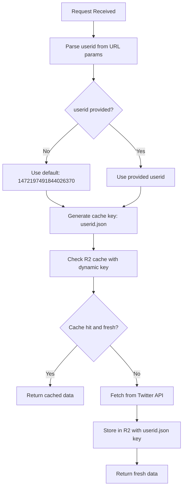
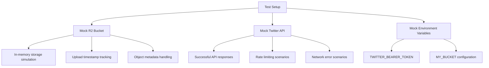

# Cloudflare Worker Cache Fix Implementation Plan

## Problem Analysis

### Current Issue
The Cloudflare worker has a critical caching flaw where all user-specific Twitter data is stored under the same cache key (`latest.json`). This causes cache collisions where:

- Fetching tweets for MoonwellDeFi (userid: `1472197491844026370`) overwrites any cached data
- Fetching tweets for Mamo_agent (userid: `1883305846995845120`) overwrites the MoonwellDeFi cache
- Any subsequent userid requests overwrite previous caches

### Root Cause
Looking at [`src/index.ts`](src/index.ts:30-69):

1. **Line 30**: Cache lookup happens with hardcoded `'latest.json'` key
2. **Line 42**: `userid` parameter is parsed *after* the cache operation
3. **Line 69**: Data is stored back to the same hardcoded key

This creates a race condition where different userids share the same cache entry.

## Solution Overview

### Core Changes Required



## Implementation Phases

### Phase 1: Fix Core Caching Logic

#### Changes to [`src/index.ts`](src/index.ts):

1. **Move parameter parsing before cache operations**
   - Extract `userid` from URL search params at the beginning
   - Extract `max_results` parameter alongside userid
   - Set default userid if not provided

2. **Implement dynamic cache keys**
   - Replace hardcoded `'latest.json'` with `${userid}.json`
   - Update both R2 `.get()` and `.put()` operations
   - Ensure cache key consistency throughout the request lifecycle

3. **Maintain backward compatibility**
   - Keep existing API interface unchanged
   - Preserve all existing query parameters
   - Maintain same response format

#### Code Structure Changes:
```typescript
// New flow order:
export default {
  async fetch(request: Request, env: Record<string, any>) {
    // 1. Parse URL and extract parameters
    const url = new URL(request.url)
    const userid = url.searchParams.get('userid') || '1472197491844026370'
    const max_results = parseInt(url.searchParams.get('max_results') || '6')
    
    // 2. Generate dynamic cache key
    const cacheKey = `${userid}.json`
    
    // 3. Check cache with user-specific key
    const object = await env.MY_BUCKET.get(cacheKey)
    
    // 4. Rest of logic remains similar but uses dynamic key
  }
}
```

### Phase 2: Set Up Vitest Testing Environment

#### Dependencies to Add:
```json
{
  "devDependencies": {
    "vitest": "^1.0.0",
    "@vitest/environment-miniflare": "^1.0.0",
    "miniflare": "^3.0.0",
    "wrangler": "^3.0.0"
  }
}
```

#### Test Configuration:
- **File**: `vitest.config.ts`
- **Environment**: Miniflare for Cloudflare Workers simulation
- **Test patterns**: `test/**/*.test.ts`
- **Coverage**: Comprehensive coverage reporting

#### Mock Strategy:


### Phase 3: Comprehensive Test Suite

#### Test File Structure:
```
test/
├── worker.test.ts              # Main worker functionality tests
├── cache.test.ts               # Cache-specific logic tests
├── api-integration.test.ts     # Twitter API integration tests
├── error-handling.test.ts      # Error scenarios and edge cases
├── mocks/
│   ├── r2-bucket.mock.ts      # R2 bucket operations mock
│   ├── twitter-api.mock.ts    # Twitter API response mock
│   └── environment.mock.ts    # Environment variables mock
├── fixtures/
│   ├── twitter-responses.json # Sample Twitter API responses
│   └── test-data.json        # Test userids and expected outputs
└── setup.ts                   # Global test setup and configuration
```

#### Test Categories:

1. **Cache Isolation Tests**
   ```typescript
   describe('Cache Isolation', () => {
     test('Different userids have separate cache entries')
     test('MoonwellDeFi cache doesn\'t affect Mamo_agent cache')
     test('Cache keys are userid-specific')
     test('Concurrent requests don\'t interfere')
   })
   ```

2. **Cache Lifecycle Tests**
   ```typescript
   describe('Cache Lifecycle', () => {
     test('Fresh cache returns immediately')
     test('Stale cache (>901 seconds) triggers refresh')
     test('Missing cache triggers API call')
     test('Cache stores data with correct metadata')
   })
   ```

3. **API Integration Tests**
   ```typescript
   describe('Twitter API Integration', () => {
     test('Successful API response gets cached')
     test('API failure returns stale cache if available')
     test('Rate limiting is handled gracefully')
     test('Different max_results values work correctly')
   })
   ```

4. **Error Handling Tests**
   ```typescript
   describe('Error Handling', () => {
     test('Network errors during Twitter API calls')
     test('R2 bucket access failures')
     test('Invalid userid formats')
     test('Missing environment variables')
   })
   ```

5. **Parameter Validation Tests**
   ```typescript
   describe('Parameter Validation', () => {
     test('Default userid when not provided')
     test('Custom userid parameter handling')
     test('max_results parameter validation')
     test('Invalid parameter graceful handling')
   })
   ```

### Phase 4: Enhanced Worker Features

#### Additional Improvements:

1. **Input Validation**
   - Validate userid format (numeric string)
   - Sanitize max_results parameter
   - Handle edge cases gracefully

2. **Enhanced Error Responses**
   - Structured JSON error messages
   - Appropriate HTTP status codes
   - Helpful error descriptions

3. **Improved Logging**
   - Cache hit/miss logging with userid
   - API call tracking
   - Error context logging

4. **Performance Optimizations**
   - Parallel processing where possible
   - Memory efficient response handling
   - Optimized cache key generation

## Implementation Details

### Modified Worker Logic Flow:

```typescript
// Pseudocode for new implementation
async function handleRequest(request: Request, env: Environment) {
  // Phase 1: Parameter extraction and validation
  const { userid, max_results } = extractAndValidateParams(request.url)
  
  // Phase 2: Dynamic cache key generation
  const cacheKey = generateCacheKey(userid)
  
  // Phase 3: Cache lookup with user-specific key
  const cachedData = await getCachedData(env.MY_BUCKET, cacheKey)
  
  // Phase 4: Cache freshness check
  if (isCacheFresh(cachedData)) {
    return createResponse(cachedData.body)
  }
  
  // Phase 5: Twitter API call
  const freshData = await fetchFromTwitter(userid, max_results, env.TWITTER_BEARER_TOKEN)
  
  // Phase 6: Store with user-specific cache key
  await storeCachedData(env.MY_BUCKET, cacheKey, freshData)
  
  return createResponse(freshData)
}
```

### Cache Key Strategy:
- **Format**: `${userid}.json`
- **Examples**:
  - MoonwellDeFi: `1472197491844026370.json`
  - Mamo_agent: `1883305846995845120.json`
  - Custom userid: `1234567890.json`

### Backward Compatibility:
- All existing API endpoints remain unchanged
- Same query parameters (`userid`, `max_results`)
- Identical response format
- Same CORS headers and error handling

## Testing Strategy

### Test Data Setup:
```typescript
const TEST_USERIDS = {
  MOONWELL_DEFI: '1472197491844026370',
  MAMO_AGENT: '1883305846995845120',
  CUSTOM_USER: '1234567890'
}

const MOCK_TWITTER_RESPONSES = {
  [TEST_USERIDS.MOONWELL_DEFI]: { /* realistic response data */ },
  [TEST_USERIDS.MAMO_AGENT]: { /* realistic response data */ },
  [TEST_USERIDS.CUSTOM_USER]: { /* realistic response data */ }
}
```

### Performance Testing:
- Concurrent requests for different userids
- Cache efficiency measurements
- Memory usage validation
- Response time benchmarks

### Integration Testing:
- End-to-end request/response cycles
- Real R2 bucket operations (optional)
- Twitter API mock integration
- Error scenario simulations

## Expected Outcomes

### 1. Cache Isolation Success
- ✅ MoonwellDeFi tweets cached independently
- ✅ Mamo_agent tweets cached independently  
- ✅ No cache collisions between different userids
- ✅ Proper cache expiration (901 seconds) for each user

### 2. Comprehensive Test Coverage
- ✅ 90%+ code coverage
- ✅ All critical paths tested
- ✅ Error scenarios covered
- ✅ Performance benchmarks established

### 3. Maintainability Improvements
- ✅ Clear test structure for future changes
- ✅ Well-documented code with type safety
- ✅ Robust error handling
- ✅ Performance monitoring capabilities

### 4. Production Readiness
- ✅ No breaking changes to existing API
- ✅ Improved reliability and performance
- ✅ Better debugging and monitoring
- ✅ Scalable architecture for additional userids

## Risk Mitigation

### Potential Issues and Solutions:

1. **Cache Key Conflicts**
   - Risk: Invalid userid formats could cause issues
   - Solution: Input validation and sanitization

2. **R2 Storage Costs**
   - Risk: More cache files could increase storage costs
   - Solution: Implement cache cleanup for inactive userids (future enhancement)

3. **Test Environment Setup**
   - Risk: Complex Vitest + Miniflare configuration
   - Solution: Step-by-step setup with detailed documentation

4. **Backward Compatibility**
   - Risk: Breaking existing integrations
   - Solution: Comprehensive integration testing

## Success Criteria

- [ ] Cache collisions eliminated
- [ ] All existing functionality preserved
- [ ] Comprehensive test suite with >90% coverage
- [ ] Performance maintained or improved
- [ ] Documentation updated
- [ ] Ready for production deployment

## Timeline

1. **Phase 1** (Core Fix): 2-3 hours
2. **Phase 2** (Test Setup): 1-2 hours
3. **Phase 3** (Test Implementation): 3-4 hours
4. **Phase 4** (Enhancements): 1-2 hours

**Total Estimated Time**: 7-11 hours of development work

---

## Next Steps

Once this plan is approved, we'll proceed with:
1. Implementing the cache fix in [`src/index.ts`](src/index.ts)
2. Setting up Vitest configuration
3. Creating comprehensive test suite
4. Validating all functionality works as expected
5. Documentation updates

This plan ensures a robust, well-tested solution that eliminates the cache collision issue while maintaining full backward compatibility.